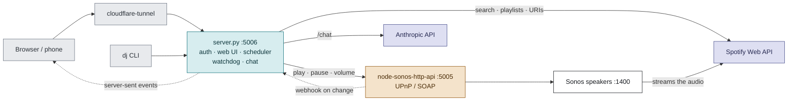
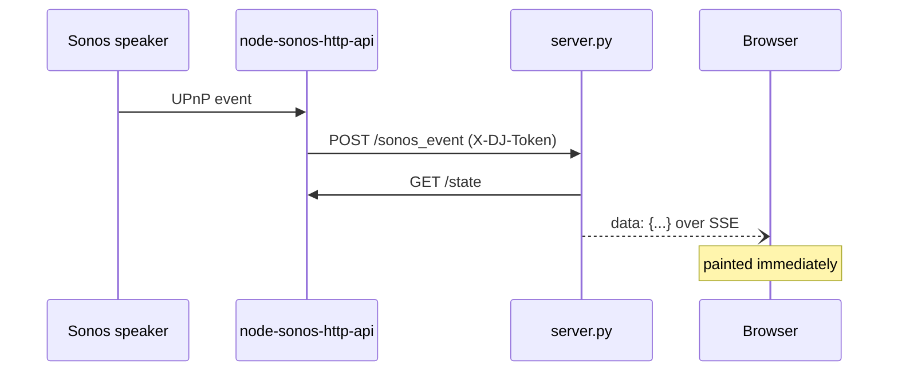

# DJ Assistant

A natural language DJ assistant that controls Spotify playback on Sonos speakers. Features a web UI, Claude AI integration, and CLI access.


## Features

- 🎵 **Natural Language Control** - "play some jazz", "queue that Beatles song", "skip this"
- 🌐 **Web UI** - Mobile-friendly interface for party guests
- 📚 **Browse Playlists** - View and play your Spotify playlists
- 💿 **Album View** - See full album with artwork when a song plays
- 🎤 **Artist Top Tracks** - Discover more from the current artist
- ➕ **Create Playlists** - Create new playlists and add songs
- 🤖 **Claude AI** - Understands context and conversational requests
- 🔍 **Spotify Search** - Search tracks, albums, artists, playlists
- 📋 **Queue Management** - Add to queue, play next, clear queue, view queue
- 🎚️ **Playback Controls** - Play, pause, skip, previous, volume
- ❤️ **Library Access** - Browse playlists, liked songs
- ⏰ **Routines** - Multi-step schedules: fade the volume up, start a playlist, pause at 11
- 📻 **Stations** - Save a Song Radio URI once, replay or schedule it in a tap
- 🔀 **Shuffle** - Toggle from the player, follows changes made in the Sonos app
- ↔️ **Queue Editing** - Drag to reorder, remove a track, see what has already played
- ⏩ **Seek** - Scrub within the current track
- 🌓 **Light and Dark** - Follows the system theme, or pick one
- 💻 **CLI** - Full command-line control via `dj` command

## Architecture

Two processes, layered rather than competing. **`server.py` is policy** — auth,
the web UI, the routine scheduler, natural language, and anything that needs a
Spotify *account*. **`node-sonos-http-api` is a device driver** — it speaks
UPnP/SOAP to the speakers so nothing else has to.



Inside `server.py` two background loops run on CherryPy `Monitor` plugins: the
**scheduler** ticks every 20s and fires any routine step that is due, and the
**watchdog** ticks every 60s and checks that Sonos is not just answering but
actually has speakers discovered. Persistent state is three JSON files —
`schedules.json`, `stations.json` and `config.json`.

Three things in that picture are easy to get wrong:

**The audio never touches either process.** The speaker streams from Spotify
directly, which is why playback carries on while you restart the server.

It does still land in your Spotify listening history, though — the speaker
streams through the Spotify account linked in the Sonos app (the `sid=12`
and `sn=2` in every `x-sonos-spotify:` URI), and that integration reports
plays. What this server's own OAuth token does *not* do is control or report
playback: it holds no Connect scopes and is used only for search, playlist
lookup and turning a search result into a URI.

**Playback is never done directly.** Every play, pause and volume call goes out
to node-sonos-http-api. If it is not running, this server returns 502 rather
than pretending. macOS grants Local Network access per process and the
launchd-run Python server does not have it, so direct UPnP calls from Python
fail with "no route to host" — which is also why the custom actions in
`sonos-actions/` live on the Node side.

**The browser is told, not asked.** The UI used to poll `/nowplaying` every ten
seconds, which was roughly 90% of all traffic and still left it up to ten
seconds stale. Sonos now posts to `/sonos_event` when something actually
changes and the server relays it over server-sent events:



Polling remains as a fallback and is dropped as soon as the stream opens, so a
browser that cannot hold an EventSource still works — just less promptly.

## Web UI

A two-column split on a desktop, a single column with a compact player bar on
a phone. Everything is reachable without scrolling unless the list is genuinely
long.

- **Player** — artwork, transport, a seek bar, volume with ±1 buttons, shuffle
- **Search** — tracks, albums, artists and playlists; expand an album in place
  to see its tracks. Each row can play, queue, play next, add to a playlist, or
  be scheduled
- **Queue** — what has already played and what is coming, drag to reorder,
  ✕ to remove
- **Schedule** — routines as a grouped list or a weekly calendar. The editor
  opens as a sheet on a phone and a dialog on a desktop; steps show the
  wall-clock time they fire at, and the next run is always visible
- **Ask** — natural language requests: "play something chill", "skip this"

## CLI Usage

```bash
# Search
dj search bohemian rhapsody
dj search beatles

# Play from search results
dj play 1                    # play result #1 immediately
dj queue 2                   # add #2 to end of queue (alias: dj q)
dj next 3                    # play #3 after current song (alias: dj n)

# Playback controls
dj pause
dj resume                    # alias: dj r
dj skip                      # alias: dj s
dj prev

# Volume
dj vol                       # show current volume
dj vol 50                    # set to 50
dj vol up                    # +10
dj vol down                  # -10

# Queue management
dj np                        # now playing
dj showqueue                 # view queue (alias: dj sq)
dj clear                     # clear queue

# Library
dj like                      # like current song
dj playlists                 # your playlists
dj liked                     # your liked songs

# Help
dj help
```

## API Endpoints

| Endpoint | Description |
|----------|-------------|
| `/health` | Sonos + Spotify reachability; 503 if either is down. Sonos counts as healthy only if it reports discovered speakers, not merely a 200 |
| `/metrics` | Counters since process start: call volume, failures, transport and content latency, schedule fires, stream clients. Makes no upstream call |
| `/stream` | Server-sent events; pushes the now-playing payload whenever Sonos changes something |
| `/albumart` | The current track's cover, proxied from the speaker. Sonos serves art over plain HTTP on a private address, which the browser blocks as mixed content once the UI is behind the tunnel |
| `/sonos_event` | Where node-sonos-http-api posts its change notifications (POST). Authenticated with the same `X-DJ-Token` |
| `/schedules` | List scheduled actions |
| `/schedule_save` | Create or replace a whole routine, steps included (POST, JSON body) |
| `/schedule_delete` | Remove by id (POST) |
| `/schedule_toggle` | Enable/disable by id (POST) |
| `/schedule_run` | Run every step now, ignoring offsets (POST) |
| `/stations` | List saved radio stations |
| `/station_add` | Save a named radio URI (POST) |
| `/station_delete` | Remove one by id (POST) |
| `/ui` | Web interface |
| `/chat?message=<text>` | Natural language (Claude AI) |
| `/search?q=<query>` | Search Spotify |
| `/play?num=<n>` | Play search result |
| `/queue?num=<n>` | Add to end of queue |
| `/next?num=<n>` | Add to play next |
| `/pause` | Pause playback |
| `/resume` | Resume playback |
| `/skip` | Skip track |
| `/previous` | Previous track |
| `/volume?level=<0-100>` | Set volume |
| `/volume?change=<+/-10>` | Adjust volume; reports the level it landed on |
| `/shuffle` | Read shuffle state |
| `/shuffle?state=on\|off` | Turn shuffle on or off |
| `/nowplaying` | Current track info |
| `/getqueue` | View queue |
| `/queue_window?offset=&limit=` | A slice of the queue plus the playing position |
| `/queue_move` | Reorder a track (POST) |
| `/queue_remove` | Remove a track (POST) |
| `/clearqueue` | Clear queue |
| `/my/playlists` | Your playlists |
| `/my/liked` | Your liked songs |
| `/like` | Like current track |
| `/recommend?based_on=nowplaying` | Top tracks from current artist |
| `/album_tracks?based_on=nowplaying` | Album tracks for the current song |
| `/album_tracks?uri=spotify:album:…` | Tracks of a named album |
| `/search?q=&type=album` | Album results (also `artist`, `playlist`) |
| `/seek?to=<seconds>` | Jump to a position in the current track |
| `/create_playlist?name=<name>` | Create new playlist |
| `/add_to_playlist?playlist_id=<id>&num=<n>` | Add track to playlist |
| `/help` | List the CLI commands |

## Requirements

- A machine that stays on: macOS (launchd, described here) or Linux (systemd)
- Python 3.10 or newer
- Python 3.11+ and Node.js
- Sonos speaker on your network
- Spotify Premium account
- Anthropic API key (for Claude integration)
- Cloudflare account (for public access)

## Installation

### 1. Install dependencies

macOS:

```bash
brew install node python jq
python3.13 -m venv venv          # not `python3`: see below
./venv/bin/pip install -r requirements.txt
```

The explicit `python3.13` matters. macOS ships Python 3.9 as
`/usr/bin/python3`, and if that comes first on your PATH the venv is built
with an interpreter too old for these pins. pip then reports it as "no
matching distribution found for requests", which does not sound like a
version problem at all. Any 3.10 or newer works.

Debian/Raspberry Pi:

```bash
sudo apt update && sudo apt install -y nodejs npm python3-venv jq
python3 -m venv venv             # needs 3.10+; check with python3 -V
./venv/bin/pip install -r requirements.txt
```

`jq` is needed by `dj_aliases.sh`.

To run the tests as well:

```bash
./venv/bin/pip install -r requirements-dev.txt
./venv/bin/python -m pytest
```

The suite needs no network, credentials or Sonos.

### 2. Install node-sonos-http-api

The bridge is a separate upstream project, so it is not vendored here. Once
you have cloned this repo and written `config.json` (steps 3 and 4), one
command does the whole Sonos side — clone, install, copy this project's custom
actions in, and point its webhook back at the server:

```bash
scripts/setup-sonos.sh                       # ~/Projects/node-sonos-http-api
scripts/setup-sonos.sh /path/to/somewhere    # or wherever you keep it
```

It is safe to re-run, and worth re-running after updating node-sonos-http-api:
`lib/actions/` lives inside that clone, so a fresh checkout drops the custom
actions. Existing keys in its `settings.json` are preserved.

The rest of this section is what the script does, for anyone doing it by hand
or debugging it.

```bash
cd ~
git clone https://github.com/jishi/node-sonos-http-api.git
cd node-sonos-http-api
npm install
```

Then add this project's custom actions, which upstream does not ship:

```bash
cp ~/spotify-server/sonos-actions/*.js ~/node-sonos-http-api/lib/actions/
```

They register `queuemove` and `queueremove`, which the web UI's drag-and-drop
needs, and `relvolume`, which asks the speaker to apply a relative volume
change and report where it landed rather than resolving it against a cached
value. They live in node-sonos-http-api rather than in `server.py` because
**macOS grants Local Network access per process**: the launchd-run Python
server cannot open a connection to the speaker at all (UPnP calls fail with
"no route to host"), while node-sonos-http-api, which talks to it constantly,
can. Calling the speaker directly from Python works from a terminal and fails
once deployed — a difference worth knowing before reaching for it.

Re-run the copy after updating node-sonos-http-api; `lib/actions/` is inside
that clone, so a fresh checkout drops them.

Finally, point it at this server so the UI can be pushed changes instead of
polling for them. Create `settings.json` in the node-sonos-http-api clone —
the keys merge onto its defaults, so nothing else is affected:

```json
{
    "webhook": "http://localhost:5006/sonos_event",
    "webhookHeaderName": "X-DJ-Token",
    "webhookHeaderContents": "THE_SAME_cli_token_FROM_config.json"
}
```

This file holds a credential, so `chmod 600 settings.json`. It is also the one
piece of setup that lives outside this repo: **rebuild that clone and the web
UI silently falls back to polling** until you recreate it. Nothing breaks, it
just goes back to being up to ten seconds stale.

### 3. Clone this repo

```bash
cd ~
git clone https://github.com/reddsauce1/spotify-sonos-cli.git
cd spotify-sonos-cli
```

### 4. Configure

```bash
cp config.example.json config.json
nano config.json
```

```json
{
    "client_id": "YOUR_SPOTIFY_CLIENT_ID",
    "client_secret": "YOUR_SPOTIFY_CLIENT_SECRET",
    "sonos_room": "Dining Room",
    "anthropic_api_key": "YOUR_ANTHROPIC_API_KEY",
    "ui_password": "PICK_SOMETHING",
    "cli_token": "GENERATE_ONE_SEE_BELOW"
}
```

- Get Spotify credentials at https://developer.spotify.com/dashboard
- Get Anthropic API key at https://console.anthropic.com
- Find your Sonos room name: `curl http://localhost:5005/zones`.
  Spaces are fine — the room is percent-encoded for you, and an already-encoded
  `Dining%20Room` is accepted too
- Generate the CLI token:
  `python3 -c 'import secrets; print(secrets.token_hex(32))'`

**`ui_password` and `cli_token` are required, and the server refuses to start
without them.** This is deliberate: the service is reachable from the internet
through the tunnel, so forgetting a key and deciding to run unauthenticated
must not produce the same result. If you really do want no authentication —
on a trusted LAN with no tunnel, say — ask for it explicitly:

```json
{ "allow_open_access": true }
```

Everything else is optional. Without `anthropic_api_key` the `/chat` endpoint
is disabled and the rest of the server runs normally. Any other tunable can be
overridden here too; the defaults live in the `DEFAULTS` dict in `server.py`.

### 5. Authenticate with Spotify

First-time auth requires a browser. On your Mac/PC:

```bash
./venv/bin/python auth.py   # opens a browser, writes .cache
```

Run this on the machine that will host the server. If you authenticate
elsewhere, copy `.cache` across (`scp .cache user@host:~/spotify-server/`).

`.cache` holds a long-lived refresh token in plaintext — treat it like a
password. To **rotate** it, revoke the app first at
https://www.spotify.com/account/apps/ and then re-run `auth.py`; re-running
alone issues a new token but leaves the old one valid.

### 6. Set up services

Two services need to stay running: `node-sonos-http-api` (port 5005) and this
server (port 5006).

**macOS (launchd)** — create `~/Library/LaunchAgents/com.you.spotify-server.plist`:

```xml
<?xml version="1.0" encoding="UTF-8"?>
<!DOCTYPE plist PUBLIC "-//Apple//DTD PLIST 1.0//EN" "http://www.apple.com/DTDs/PropertyList-1.0.dtd">
<plist version="1.0">
<dict>
    <key>Label</key>
    <string>com.you.spotify-server</string>
    <key>ProgramArguments</key>
    <array>
        <string>/full/path/to/spotify-server/venv/bin/python3</string>
        <string>server.py</string>
    </array>
    <key>WorkingDirectory</key>
    <string>/full/path/to/spotify-server</string>
    <key>RunAtLoad</key>
    <true/>
    <key>KeepAlive</key>
    <true/>
    <key>StandardOutPath</key>
    <string>/full/path/to/spotify-server/logs/launchd.log</string>
    <key>StandardErrorPath</key>
    <string>/full/path/to/spotify-server/logs/launchd.err.log</string>
</dict>
</plist>
```

Make an equivalent plist for node-sonos-http-api, then:

```bash
mkdir -p logs
launchctl load ~/Library/LaunchAgents/com.you.spotify-server.plist
```

`KeepAlive` restarts the process if it exits, so `kill` is a safe way to
restart it. To apply code changes:

```bash
launchctl kickstart -k gui/$(id -u)/com.you.spotify-server
```

**Linux (systemd):**

```ini
# /etc/systemd/system/spotify-api.service
[Unit]
Description=DJ Server
After=network-online.target

[Service]
Type=simple
User=YOUR_USER
WorkingDirectory=/home/YOUR_USER/spotify-server
ExecStart=/home/YOUR_USER/spotify-server/venv/bin/python server.py
Restart=always

[Install]
WantedBy=multi-user.target
```

```bash
sudo systemctl daemon-reload
sudo systemctl enable --now sonos-api spotify-api
```

On startup the server logs one line stating what it believes — room, model,
and whether auth, the CLI token and Claude are configured:

```
01/Aug/2026:16:21:58 INFO    dj: Starting DJ server: room=Dining%20Room model=claude-sonnet-5 auth=on cli_token=set claude=configured
```

### 7. Set up CLI aliases

Add to your shell's rc file (`~/.zshrc` on modern macOS, `~/.bashrc` on Linux):

```bash
source ~/spotify-server/dj_aliases.sh
```

Then reload it (`source ~/.zshrc`). The aliases read `cli_token` from
`config.json` at load time, so re-source after rotating it.

### 8. Set up Cloudflare Tunnel (for public access)

1. Create account at https://cloudflare.com
2. Add your domain and update nameservers
3. Go to Zero Trust → Networks → Tunnels → Create tunnel
4. Install cloudflared:
```bash
brew install cloudflared                       # macOS
# Linux/Pi: download the build matching your architecture from
# https://github.com/cloudflare/cloudflared/releases/latest
```
5. Run the install command Cloudflare provides
6. Add public hostname: `dj.yourdomain.com` → `http://localhost:5006`

## Troubleshooting

### Check services

```bash
launchctl list | grep -i 'spotify\|sonos\|cloudflare'   # macOS
sudo systemctl status sonos-api spotify-api cloudflared  # Linux
```

Or ask the server itself — this reports whether the upstreams are actually
reachable, and returns 503 if either is down:

```bash
curl -H "X-DJ-Token: $(jq -r .cli_token config.json)" http://localhost:5006/health
# {"sonos": "ok", "spotify": "ok", "uptime_seconds": 1042}
```

### View logs

```bash
tail -f logs/spotify-server.log          # app, access and engine, one stream
journalctl -u spotify-api -f             # Linux
```

Application messages are prefixed `dj:` and interleave with the request log:

```bash
grep ' dj: ' logs/spotify-server.log            # app events only
grep -E 'WARNING|ERROR' logs/spotify-server.log # problems only
```

`logs/spotify-server.log` is written and rotated by the server itself — 5MB
per file, five kept, so around 30MB total and months of history. That is why
the plist points stdout and stderr at `logs/launchd.log` instead: launchd
never rotates what it captures, and rotation cannot be done to a file launchd
holds open, because renaming it out from under launchd's descriptor leaves
launchd appending to the rotated-away file forever.

`logs/launchd.err.log` therefore holds only what escapes Python's logging —
a traceback from a failed start, say. It should stay near-empty; if it is
growing, something is crashing.

```bash
tail logs/launchd.err.log                # should be near-empty
```

### Restart services

```bash
launchctl kickstart -k gui/$(id -u)/com.you.spotify-server   # macOS
sudo systemctl restart sonos-api spotify-api cloudflared     # Linux
```

### Test locally

Every endpoint except `/`, `/ui` and `/login` needs credentials:

```bash
TOKEN=$(jq -r .cli_token config.json)
curl -H "X-DJ-Token: $TOKEN" http://localhost:5006/nowplaying
curl -H "X-DJ-Token: $TOKEN" "http://localhost:5006/search?q=beatles"
```

A bare `curl http://localhost:5006/nowplaying` returns
`{"error": "Authentication required"}` — that is expected, not a fault.

### `dj` commands return 401

The CLI reads `cli_token` from `config.json` when `dj_aliases.sh` is sourced.
After changing it, re-source the file (or open a new shell). If the server was
restarted but the token was only just added to `config.json`, restart the
server too.

### Token expired
Re-run auth.py on your Mac and copy the new `.cache` file to the Pi.

## Development

### Running tests

```bash
./venv/bin/pip install -r requirements-dev.txt
./venv/bin/pytest -q
```

The suite lives in `tests/` and mocks Spotify, Sonos and CherryPy, so it needs
no network, no credentials and no running server. `tests/conftest.py` feeds
`server.py` a fake config at import time, and points the schedule and station
files at a temp directory for every test — nothing can rewrite the routines
that actually fire in the morning.

It runs from anywhere: the repo root, inside `tests/`, or by absolute path
from elsewhere. `pytest.ini` puts the repo root on the import path so
`import server` resolves, and `tests/paths.py` anchors the handful of tests
that read real files — `server.py`, `static/index.html`, `README.md` — to the
repo rather than to the working directory.

## Authentication

Every API endpoint requires credentials; only `/`, `/ui` and `/login` are
public. Set `ui_password` in `config.json` to enable this — if it is empty the
server runs completely open.

There are two ways to authenticate:

- **Browser** — `/login` exchanges the password for a random session token
  stored server-side and set as an httponly cookie. Restarting the server
  invalidates all sessions.
- **CLI / scripts** — send the `cli_token` from `config.json` as an
  `X-DJ-Token` header. `dj_aliases.sh` does this for you.

Note that auth is *not* based on source IP. `cloudflared` connects over
loopback, so tunnelled internet traffic is indistinguishable from a local
request by address alone — exempting localhost would expose everything.

## Themes

The UI follows your operating system's light or dark setting by default. The
button at the right of the tab bar cycles **Auto → Light → Dark**, and the
choice is remembered per browser.

Every colour flows through CSS custom properties, so a theme is one token
block rather than a sweep through the stylesheet — tests assert that no
hard-coded colour creeps back in, that light and dark define the same token
set, and that every text/background pair clears WCAG AA (4.5:1) in both.

Each theme has two accents. Dark uses a pale green with a faint pink; light
uses a chocolate brown with a green. The second accent means "here / now" —
the track playing in the queue, and today's column in the week view — rather
than being decoration sprinkled about.

Light is not an inversion: its accents are darker so they still read on a pale
ground, and take white text rather than near-black.

## The queue

The Queue tab shows a window around the current track — already-played tracks
dimmed, the current one highlighted, the rest upcoming. Position comes from
Sonos, which is the only thing that knows it: Spotify's own recently-played
history stays empty because playback happens through Sonos rather than a
Spotify client.

Drag a row to reorder it, or press ✕ to remove it. Both carry the title the
row was showing, and the server refuses with **409** if the queue moved
underneath — tracks finish and other clients edit, so an index on its own is
not a safe address for a change.

Queues run to tens of thousands of tracks, so the view is a 50-track window
with earlier/later paging rather than the whole list; fetching all of it takes
longer than the request timeout.

## Schedules

Open **⏰ Scheduled actions** in the web UI. A schedule is a *routine*: a
trigger time, the days it runs, and an ordered list of steps, each with a
minute offset from the trigger. That is what makes a gradual wake-up
expressible:

```
 WEEKDAYS ─────────────────────────────────
  07:00   Weekday Wake-up               🔔 ⚡ 🗑
     +0m  🔊  volume 12
     +0m  ▶   play  spotify:playlist:37i9…
    +10m  🔊  volume 22
    +25m  🔊  volume 32
    +60m  ⏸   pause
```

Actions: `play`, `pause`, `resume`, `skip`, `previous`, `volume`, `clearqueue`.
For `play`, a volume on the same step is applied **before** playback starts, so
an alarm cannot blast at whatever level last night ended on.

The ⚡ button runs every step immediately, ignoring offsets — so you can check a
playlist URI works without sitting through a 60-minute fade.

### Viewing what's scheduled

The ⏰ panel has two views. **☰ List** groups routines by the days they run;
**🗓 Week** shows a seven-column grid so clashes are visible at a glance —
which is how a stray 07:15 `pause` sitting in the middle of a 07:00 wake-up
gets spotted. Only enabled routines appear in the grid.

### How it behaves

Steps are matched against the clock on every tick rather than run by a sleeping
thread. Two things follow from that:

- **A restart mid-routine loses nothing.** If the server is replaced between the
  07:00 trigger and the +60m step, that step still fires at 08:00.
- **A late start does not fire a missed alarm.** A server that was down at 07:00
  and comes back at 09:30 skips it, because steps match on the exact minute.

Offsets may cross midnight — a 23:50 wind-down with a +30m step fires at 00:20.
That step still belongs to the *trigger* day, so a Friday-only routine runs its
00:20 step on Saturday morning.

Times are local wall-clock, so DST behaves as you would expect: a trigger inside
the skipped hour on the spring-forward day does not fire, and on fall-back the
repeated hour cannot fire anything twice.

Routines live in `schedules.json` and survive restarts. Entries written by the
first version (one flat action per schedule) are migrated to a single
zero-offset step automatically.

To get a playlist URI: right-click a playlist in Spotify → Share → Copy Spotify
URI, or run `dj playlists` and take the `uri` field.

## Stations (Song Radio)

Spotify exposes Song Radio as an algorithmic playlist — right-click a track →
**Go to Song Radio** → Share → Copy link, and you get a
`spotify:playlist:37i9dQZF1E8…` URI.

Those URIs **404 on the Spotify Web API but play fine through Sonos**, because
Sonos has its own Spotify integration. Paste one into the 📻 STATIONS box with
a name, and it becomes reusable: one tap to play or queue, and selectable as a
schedule step alongside your own playlists.

What is *not* possible is generating a radio URI for a track from inside the
app. That needs `/v1/recommendations` or `/v1/artists/{id}/related-artists`,
both withdrawn from third-party apps in November 2024 — they return 404 here.
`artist_top_tracks` still works, which is what `/recommend` uses.

## Searching

One query runs both an album and a track search, so results come back as
**Albums** above **Tracks**. Click the ▸ on an album to expand its tracks in
place; the album row itself plays or queues the whole thing.

Spotify's field filters work in the same box, which is why there is no type
selector in the way:

```
album:Rumours
artist:"Fleetwood Mac" album:Rumours
year:1977 album:Rumours
```

Expanding an album deliberately does **not** update the server's numbered
results, so doing it in the browser cannot change what `dj play 3` means in a
terminal alongside.

## Building playlists

Search for a track and press ➕ to add it to any of your playlists, or create a
new one inline. Schedule steps then pick a playlist or station from a dropdown
rather than needing a pasted URI.

`/create_playlist` and `/add_to_playlist` are POST-only — they change Spotify
state, so a GET would let a stray link or a browser prefetch mutate a playlist.

## Project Structure

```
spotify-server/
├── server.py             # DJ server (port 5006)
├── auth.py               # One-off Spotify OAuth flow -> .cache
├── static/index.html     # Web UI markup, CSS and JS
├── dj_aliases.sh         # `dj` CLI (needs jq)
├── sonos-actions/        # Plugins copied into node-sonos-http-api
├── config.json           # Credentials + settings   (gitignored)
├── .cache                # Spotify OAuth token      (gitignored)
├── schedules.json        # Scheduled routines       (gitignored)
├── stations.json         # Saved radio URIs         (gitignored)
├── logs/                 # rotated app log + crash log (gitignored)
├── requirements.txt      # Runtime dependencies, pinned
├── requirements-dev.txt  # Test dependencies
├── pytest.ini            # testpaths + import path for the suite
├── docs/                 # Notes kept out of the README
└── tests/                # Test suite -- no network or credentials needed
    ├── conftest.py       #   fixtures; mocks Spotify and config
    ├── paths.py          #   locations of the real files some tests read
    └── test_*.py

~/node-sonos-http-api/
└── (Sonos control server, port 5005)
```

Settings live in `DEFAULTS` at the top of `server.py` (timeouts, limits, model,
port) and any of them can be overridden by adding the same key to
`config.json`.

## License

MIT